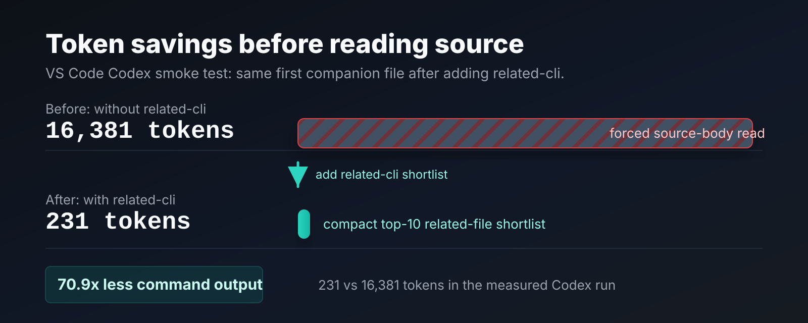

<div align="center">

# related-cli

**Content-blind related-file ranking from Git co-change history**

[](https://www.npmjs.com/package/related-cli)
[](https://github.com/ifapmzadu6/related-cli/actions/workflows/ci.yml)
[](package.json)
[](Cargo.toml)
[](LICENSE)

</div>

`related` is a small CLI that ranks files related to a target file using only Git
co-change history.

The token reduction can be huge: in a VS Code smoke test, Codex found the same
first companion file from a `231`-token `related` shortlist that took `16,381`
command-output tokens when forced to read source bodies without `related`.
Direct artifact measurements showed the same shortlist replacing `8.6k` to
`46.1k` tokens of speculative pre-read file context.



It intentionally does not parse source code, imports, symbols, embeddings, or file
contents. That makes the signal language-agnostic and useful for code, docs,
configs, migrations, prompts, runbooks, and any other files tracked in Git.

## Idea

If two files are repeatedly changed in the same commit, they probably carry an
operational relationship. `related` turns that history into a weighted graph:

- file = node
- same-commit change = edge
- large commits are down-weighted
- older commits are time-decayed

Queries can use either direct co-change ranking or Personalized PageRank over the
co-change graph.

## Skill Installation

The npm package ships a portable skill at `skills/find-related-files`. The skill
does not vendor the binary and does not require a global CLI install; it calls
the published npm package with `npx -y --package related-cli@latest related ...`.

Run the installer from the target project root to copy the skill folder into
your agent's skill directory. Re-run the same command later to refresh the
copied skill instructions.

### Codex

Project install is recommended for shared repositories:

```sh
npx -y --package related-cli@latest related-install-skill
```

Run it from the target project root. It copies the skill to
`.codex/skills/find-related-files` in the current project. Commit that directory
when you want the same pre-edit related-file workflow to travel with the
repository.

User-level install is also available as an explicit option, but is mainly useful
for local experiments:

```sh
npx -y --package related-cli@latest related-install-skill --user
```

Restart Codex after installing the skill.

### Claude Code

Project install is recommended for shared repositories:

```sh
npx -y --package related-cli@latest related-install-skill claude
```

Run it from the target project root. It copies the skill to
`.claude/skills/find-related-files` in the current project.

User-level install, available in all projects:

```sh
npx -y --package related-cli@latest related-install-skill claude --user
```

Claude Code can load the skill automatically from its description, or you can
invoke it directly with `/find-related-files`.

## CLI

The skill is the intended entry point for agent use. The CLI remains available
for direct checks:

```sh
npx -y --package related-cli@latest related query src/auth.ts --top 20
npx -y --package related-cli@latest related diff --staged --top 20
```

By default commands run against the current directory's Git repository. Use
`--repo PATH` only when querying another checkout from outside that repository.
No persistent index is created; the graph is built on demand from the target
file's Git history.

The default backend, `pack-fast`, is optimized for low-latency agent calls in
large repositories and may stop before an exact full history walk. Use
`--history-backend git` when exact Git history is more important than speed, or
`--history-backend pack-scan` for a deeper pack-only scan.

If the top results all look like broad release, dependency, formatting, or
initial-commit churn, inspect evidence and retry with a tighter commit-size
filter plus result exclusions before trusting the ranking:

```sh
npx -y --package related-cli@latest related query src/auth.ts --top 20 --evidence 3
npx -y --package related-cli@latest related query src/auth.ts --top 20 --max-files-per-commit 10 --exclude '*.lock,*-lock.*,*lockb,.github/workflows/*'
```

The default text output is compact for LLM-tool use: it prints ranked paths plus
short `co=` counts, and `query`/`diff` omit per-commit evidence by default. Add
`--evidence N` when example commits would help, or use `explain file-a file-b`
for one focused relationship.

## Comparison

`related` sits near tools such as LaserOwl, Glaux, Sourcebook, Qartez, repowise,
Codegraph, and CodeScene. Those systems validate the same underlying idea:
repository history is a useful signal for agent context, missed-file detection,
and change-risk analysis.

The difference is shape. Most nearby tools are broader code-intelligence
systems: they parse code, build indexes or databases, expose hosted or MCP
surfaces, combine semantic/static/history signals, or evaluate a whole edit
plan. That breadth is valuable, but it is also heavier than what an LLM often
needs immediately before touching one file.

`related` is intentionally small:

- one local Rust binary
- no persistent index
- no source parsing, embeddings, imports, ASTs, or file contents
- works for docs, prompts, configs, migrations, and code
- returns compact text suitable for an LLM tool call
- can show evidence commits when the agent needs to verify the relationship

The bet is that Git history is already a behavior graph of the project. If two
files repeatedly changed together, the repository is telling the agent, "look
here too." `related` makes that signal cheap enough to call before ordinary
edits, especially in large workspaces where grep finds text matches but not
operational coupling.

### Focused comparison: Codegraph

This section refers specifically to
[`@optave/codegraph`](https://github.com/optave/ops-codegraph-tool), the local
Tree-sitter/SQLite/MCP code graph CLI published on npm. Codegraph is a much
broader code-intelligence system than `related`: its public README describes
function-level parsing, imports, callers, dataflow, CFG, semantic search, role
classification, CI gates, MCP tools, incremental rebuilds, and Git co-change.

That breadth is useful when an agent needs structural code understanding. It is
also more tool than the narrow pre-edit question often needs:

```text
I am about to touch this file. Based only on repository history, what else
usually changes with it?
```

For that question, `related` has a deliberately smaller surface:

| Dimension | `related` | `@optave/codegraph` |
|---|---|---|
| Primary job | Rank historically related files | Build and query a source graph |
| Setup before first query | None beyond Git history and one CLI call | `codegraph build` creates `.codegraph/graph.db`; co-change requires a scan |
| Persistent storage | None | SQLite database under `.codegraph/` |
| Source parsing | No | Yes, Tree-sitter |
| Content sent to the agent | File paths, scores, counts, optional evidence commits | Depends on command; can include structural summaries, symbols, imports, callers, graph metadata |
| Works on non-code files | Yes: docs, prompts, configs, migrations, lockfiles, runbooks | Mostly code-oriented, though Git co-change is file-level |
| Failure mode | No history means weak/no ranking | Parser/language/schema/build freshness can matter |
| Best fit | Cheap "look here too" context expansion before an edit | Rich code navigation, impact analysis, MCP workflows, and CI gates |

Where `related` wins against Codegraph:

- **Zero index tax.** There is no source graph to build, refresh, cache, or
  invalidate before an agent can ask for companion files.
- **No parser boundary.** The same signal works for TypeScript, Markdown, JSON,
  YAML, prompts, generated manifests, migrations, and repo-specific operational
  files.
- **Small blast radius.** It is one Rust binary and one question. It does not
  introduce an MCP server, SQLite state, semantic embeddings, language support
  decisions, or CI policy surface just to get related files.
- **History is the product.** The ranking is based on how maintainers actually
  changed the repository, not how imports or symbols say the code could relate.
- **Composable output.** The result is easy to feed into Codex, Claude Code,
  grep, `sed`, tests, or a larger code-intelligence tool. It is not trying to be
  the whole agent workflow.
- **Better first move for broad repos.** In a large repository, the expensive
  mistake is often opening too many plausible files. `related` gives the agent a
  compact shortlist before it spends tokens reading source.

Where Codegraph wins:

- It can answer symbol-level questions that `related` intentionally cannot:
  "who calls this function?", "what imports this file?", "what is the transitive
  impact?", "is this export dead?", "what is the CFG/dataflow shape?"
- Its MCP surface is richer for agents that want a persistent code map rather
  than a one-shot companion-file hint.
- Its `brief`, `context`, `fn-impact`, `diff-impact`, `where`, `deps`, and
  semantic search commands can replace many manual `grep`/`cat` steps when the
  graph is already built and fresh.

So the comparison is not "Codegraph is bad." It is:

```text
Use Codegraph when you want a full local code graph.
Use related when you want the cheapest historical companion-file signal.
```

If the job is specifically "before editing this file, what else should an agent
inspect?", `related` is the sharper default:

- no `codegraph build`
- no `.codegraph` database
- no parser or language-support dependency
- smaller default text output in the measured VS Code code-file sweep
- faster query latency even after Codegraph is already built
- coverage for non-code files such as `package.json`, lockfiles, docs, prompts,
  configs, and migrations

The closest public CLIs that were installed and measured locally were
`@optave/codegraph` and `sourcebook`.

Measured on `microsoft/vscode`:

- repo: `/tmp/related-vscode`
- target: `src/vs/platform/sandbox/common/terminalSandboxEngine.ts`
- history window: since `2026-05-08T14:03:23-07:00`
- Codegraph version: `3.10.0`
- Sourcebook version: `0.14.0`

| tool / command | measured task | time | storage |
|---|---|---:|---:|
| `related query` x20 | Query related files on demand | `1.14s` total, `0.057s/query` | none |
| `codegraph build` | Build Codegraph DB before co-change works | `158.12s` | `527 MiB` |
| `codegraph co-change --analyze` | Populate co-change data | `2.84s` | same DB |
| `codegraph co-change <file>` x20 | Query co-change partners | `6.21s` total, `0.311s/query` | same DB |
| `sourcebook scan-history` | Scan history for co-change pairs | `3.15s` | output only |
| `sourcebook preflight --file` x20 | Suggest companion files before editing | `174.68s` total, `8.734s/query` | no persistent index used here |

For the same VS Code target, both `related` and Codegraph ranked the same top
companion file:

```text
src/vs/platform/sandbox/test/common/terminalSandboxEngine.test.ts
```

This is the practical advantage: `related` gets the high-value co-change answer
without asking the agent to wait for a source graph, database, hosted service,
or broad preflight scan. It does not replace those systems; it gives agents a
small first move that is fast, local, language-agnostic, and easy to compose
with grep, type checks, tests, or larger code-intelligence tools.

### Token efficiency on VS Code

Codegraph markets token efficiency because a code graph can answer questions
without making an agent read whole files. `related` gets token efficiency from a
different design: it does not summarize source code at all. It sends a compact
historical shortlist so the agent can decide what to open next.

Measured on the same VS Code checkout and target above, using `tiktoken`
`cl100k_base` as a reproducible tokenizer:

| artifact sent to the agent | bytes | approx tokens | note |
|---|---:|---:|---|
| `related query` text output, top 10 | `893` | `231` | no index; compact paths and co-change counts |
| `codegraph co-change` text output, top 10 | `1,162` | `331` | requires existing `.codegraph` DB and co-change analysis |
| raw target file | `35,609` | `8,625` | what the agent would spend if it opens only the target |
| raw target + top companion test | `59,295` | `14,179` | common first inspection pair |
| raw top 10 `related` companion files | `165,154` | `37,436` | why a shortlist matters before opening files |
| raw target + top 10 companion files | `200,763` | `46,061` | broad speculative read |

Framed as `related-cli` versus no `related-cli`, the measured context-selection
cost on this target was:

| workflow | context sent before choosing files | approx tokens | vs `related` text |
|---|---|---:|---:|
| with `related-cli` | Compact top-10 co-change shortlist | `231` | baseline |
| without `related-cli` | Open the target file body first | `8,625` | `37.3x` more |
| without `related-cli` | Open target + top companion test body | `14,179` | `61.4x` more |
| without `related-cli` | Speculatively open target + all top-10 companion bodies | `46,061` | `199.4x` more |

I also ran two real read-only `codex exec` smoke tests on the same target. Both
found the same first file to inspect:
`src/vs/platform/sandbox/test/common/terminalSandboxEngine.test.ts`.

| Codex run | command output tokens | reported input tokens | non-cached input tokens | output tokens |
|---|---:|---:|---:|---:|
| forced to use `related query` first | `231` | `29,809` | `12,145` | `211` |
| forbidden from using `related`/co-change tools, forced to read source bodies | `16,381` | `137,045` | `62,549` | `1,300` |

That is a `97.3%` to `99.5%` reduction in pre-read context when the alternative
is opening source files to discover companion context. This is not a claim that
every no-tool agent must read exactly those files; simple `rg` or `git log`
probes can be small too, but they answer different questions and require the
agent to guess the right lexical query. The holdout eval checks that the shorter
history signal is still useful: on the same VS Code run, the default `direct`
history ranking hit@10 was `71.9%`, versus `54.6%` for a path/name baseline and
`28.3%` for a hot-file baseline; `pagerank` reached `78.7%`.

After compacting the default output, `related`'s text shortlist is also slightly
smaller than Codegraph's text co-change table for this target, while still
requiring no database. The larger win is workflow shape: a no-index, on-demand
history call gives Codex a roughly 230-token shortlist that can prevent a
14k-46k token source-reading detour.

I then varied the target file across five recent VS Code code files. Compact
text stayed smaller than Codegraph text in all five rows, with a median of
`231` tokens for `related` vs `331` for Codegraph. Query latency over seven
runs per target had a median of `25.3ms` for `related` vs `159.3ms` for
Codegraph, after Codegraph's DB and co-change data already existed.

One non-code check is also important: `package.json` returned useful manifest
and lockfile partners from `related`, while Codegraph reported no co-change data
for that file in its graph database. That is the content-blind advantage in
practice, not just a positioning claim.

I also ran real `codex exec` measurements on `/tmp/related-vscode` with Codex
CLI `0.133.0`, read-only sandboxing, and the same "find companion files before
editing" prompt. Both runs found the same first file to inspect:
`src/vs/platform/sandbox/test/common/terminalSandboxEngine.test.ts`.

| Codex run | reported input tokens | non-cached input tokens | output tokens | result |
|---|---:|---:|---:|---|
| forced to use `related query` first | `29,792` | `12,128` | `229` | same top companion file |
| forced to use `codegraph co-change` first | `44,800` | `11,392` | `330` | same top companion file |

The total input-token numbers include Codex's fixed harness and prompt-cache
behavior, so the stable comparison is the command-output token table above. The
real Codex runs are included as a smoke test that the measured output is usable
by an agent on a large repository, not as a universal billing benchmark.

See [COMPARISON.md](COMPARISON.md) for a broader public-docs-based comparison
against nearby tools.

See [MEASUREMENTS.md](MEASUREMENTS.md) for empirical measurements across
accuracy, top-K behavior, history window size, large-commit filtering, query
latency, multiple repositories, and speed against on-demand Git history
implementations. It also documents the built-in holdout evaluation used to
compare co-change ranking against path and hot-file baselines.

To reproduce the comparison against public third-party CLIs on VS Code:

```sh
scripts/external_tool_compare.sh /tmp/related-vscode
```

To reproduce the speed comparison against similar local mechanisms:

```sh
scripts/speed_compare.py \
  --repo /tmp/related-vscode \
  --target package.json
```

## License

MIT
